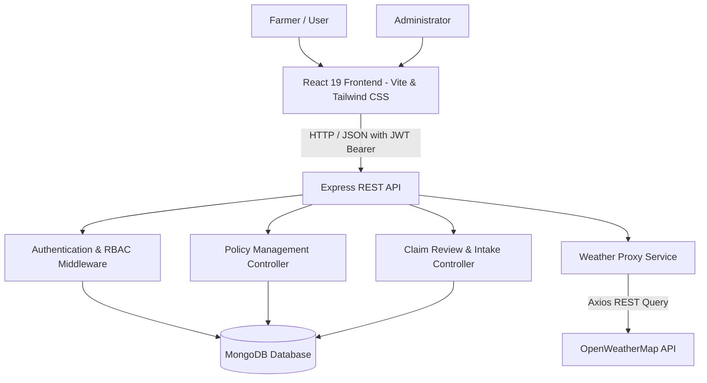

# Agricultural Insurance Management System

> A full-stack agricultural insurance management platform that streamlines crop policy creation, damage claim submission, administrative review pipelines, and live meteorological verification.


---

## 1. Overview

The **Agricultural Insurance Management System (AgriInsure)** is an end-to-end web application built to digitize and simplify the agricultural crop insurance lifecycle. It bridges the gap between rural farming communities and insurance administrators by replacing paper-heavy, slow assessment processes with a centralized modern portal.

### The Problem Addressed
Established crop insurance systems often suffer from fragmented policy catalogues, opaque claim evaluation timelines, high administrative friction, and the lack of accessible meteorological context during field damage verifications. This application provides a unified workspace where farmers can easily browse protection plans and submit claims, while administrators can evaluate incident data and inspect real-time weather conditions before making settlement decisions.

### Primary User Roles
* **Farmers (Users)**: Explore available crop protection policies, file formal loss claims with incident Indications, track multi-stage claim evaluation progress, and monitor live regional weather conditions.
* **Administrators (Insurers)**: Maintain standardized insurance policies, track overall claims metrics and platform resolution statistics, inspect filed claims, fetch supporting meteorological proxy data for incident locations, and record transparent approval or rejection decisions.

### Core Workflow Interaction

```text
Farmer / User Workflow:
  Farmer Registers / Logs In
      ↓
  Browse Standardized Crop Policies (/policies)
      ↓
  File Incident Claim with Date, Crop, & Loss Details (/submit-claim)
      ↓
  Track Multi-Stage Claim Status & Reviewer Notes (/claims)
      ↓
  Monitor Regional Hazard Conditions & Weather Context (/farmer-dashboard)

Administrator Workflow:
  Admin Logs In to Operations Center (/admin-dashboard)
      ↓
  Create, Edit, or Deactivate Crop Policies (/admin/policies)
      ↓
  Inspect Incoming Damage Claims Queue (/admin/claims)
      ↓
  Fetch On-Demand Weather Context for Claim Location
      ↓
  Record Reviewer Notes & Issue Final Approval / Rejection
```

---

## 2. Why This Project

Farming communities routinely face unpredictable climate hazards—such as droughts, flash floods, hailstorms, and unseasonal frosts. However, accessing financial protection and receiving claim payouts is often hindered by systemic bottlenecks:

1. **Manual & Fragmented Claim Processing**: Physical paperwork and fragmented spreadsheets cause prolonged delays, leaving Exposed farmers without timely compensation following severe weather events.
2. **Lack of Centralized Policy Catalogs**: Farmers frequently lack clear visibility into covered crop types, premium costs, maximum indemnity limits, and active policy durations.
3. **Opaque Claim Tracking**: Once a claim is filed, claimants often have no way to verify whether their submission is queued, under review, or resolved.
4. **Disjointed Weather Context**: Adjusters and claim reviewers rarely have immediate access to meteorological readings for the incident location, making verification cumbersome.
5. **Need for Role-Based Governance**: Sensitive operations (such as approving payouts and modifying policy financial terms) must be strictly isolated from general user capabilities.

The **Agricultural Insurance Management System** addresses these issues through a responsive, role-protected platform that streamlines administrative workflows and provides transparent claim visibility.

---

## 3. Key Capabilities

### Farmer / User
* **Secure Authentication**: Register as a Farmer and log in securely with JWT-based session management.
* **Policy Catalog**: Browse active insurance policies with transparent coverage amounts, annual premiums, crop types, and terms.
* **Claim Submission**: Submit damage claims by selecting active policies, damage causes (e.g., Drought, Flood, Pest Infestation), incident dates, farm locations, detailed descriptions, and evidence URLs.
* **Real-Time Status Tracking**: Monitor claim progress across visual lifecycle stages (*Claim Submitted* &rarr; *Verification & Review* &rarr; *Final Decision*).
* **Audit & Notes Visibility**: View official administrative review notes and evaluation timestamps for settled claims.
* **Live Weather Monitoring**: Interactive meteorological widget featuring temperature, humidity, wind velocity, sky conditions, and an agricultural risk assessment indicator (*Low*, *Moderate*, *High Risk*).

### Administrator
* **Admin Authentication & Route Protection**: Dedicated administrative access control preventing unauthorized role tampering.
* **Operational Dashboard**: Visual metric cards displaying Total Claims, Pending Reviews, Approved Claims, Rejected Claims, Total Policies, and Active Policies alongside a claim resolution pipeline rate.
* **Policy Lifecycle Management (CRUD)**: Create new crop policies, update existing policy specifications, and safely deactivate outdated policies with confirmation modals.
* **Claims Queue & Filtering**: Filter and search the complete claims ledger by farmer name, email, policy, crop, damage category, or status (*Pending*, *Approved*, *Rejected*).
* **External Weather Verification Context**: On-demand lookup of atmospheric data (temperature, wind speed, humidity, condition, and severe weather alerts) for the claim location via a secure backend proxy.
* **Decision Pipeline & Reviewer Notes**: Record formal evaluation rationale and issue binding approvals or rejections with confirmation dialogs.

---

## 4. Feature Overview

### Authentication & Authorization
* **JSON Web Token (JWT) Security**: Stateless authentication with tokens stored securely on the client and attached via Axios request interceptors.
* **Role-Based Access Control (RBAC)**: Distinct permissions for `Farmer` and `Admin` roles enforced at both the Express API middleware layer (`verifyToken`, `verifyAdmin`) and client-side route guards (`ProtectedRoute`, `GuestRoute`).
* **Registration Controls**: Public registration restricts self-assignment to the `Farmer` role; administrative accounts must be provisioned internally.

### Insurance Policy Management
* **Dynamic Policy Creation**: Administrators can define policy names, targeted crops (e.g., Rice, Wheat, Corn), annual premium amounts, maximum coverage limits, duration terms, and operational descriptions.
* **Safe Policy Deactivation**: Policies can be deactivated without deleting historic claims or cascading foreign keys, preserving data integrity.
* **Farmer Discovery**: Farmers can view all currently active policies, filter by crop type, and initiate claims directly from policy cards.

### Claim Management
* **Structured Claim Intake**: Farmers submit claims with client-side form validation (past incident dates, mandatory field locations, and policy association).
* **Three-Tier Processing Pipeline**: Visual tracking component displaying exact timeline progress and timestamped audit logs.
* **Comprehensive Review Modal**: Administrators can review farmer credentials, policy financials, incident details, attached evidence URLs, and reviewer notes in an accessible, scrollable modal view.

### Weather Integration
* **Secure Backend Proxy Architecture**: Weather queries route through the Express API proxy (`GET /api/weather?city=...`), keeping the `WEATHER_API_KEY` private and unexposed to client bundles.
* **Agricultural Risk Heuristics**: The farmer dashboard evaluates temperature extremes, precipitation, and wind speeds to determine regional hazard risk tiers.
* **Advisory Reference Only**: Meteorological information inside the claim review modal serves as external supporting context for adjusters and does **not** automatically approve or decline claims, preserving human oversight.

---

## 5. Application Screenshots

### Farmer / User Portal

#### 1. Farmer Dashboard
*Live agricultural weather monitoring, quick-action navigation, recent claims history, and claim summary metrics.*


#### 2. Insurance Policy Catalog
*Farmer view of active crop insurance plans with coverage terms, annual premiums, and one-click claim initiation.*


#### 3. Claim Status Tracker
*Real-time lifecycle tracking of submitted claims across Submission, Verification, and Final Settlement stages.*


#### 4. Claim Filing Portal
*Structured claim submission form capturing policy linkage, crop damage causes, incident dates, field addresses, and evidence URLs.*


---

### Admin Portal

#### 1. Administrative Operations Center
*High-level overview of platform metrics, policy coverage ratios, resolution analytics, and recent platform claim records.*


#### 2. Admin Policy Management
*Centralized management console to create new insurance products, adjust coverage parameters, and deactivate policies.*


#### 3. Insurance Claims Queue & Review
*Administrative queue for inspecting damage submissions, verifying external weather context, and issuing approvals or rejections.*


---

## 6. Architecture



### Component Breakdown

| Layer | Technologies & Roles |
| :--- | :--- |
| **Frontend Client** | React 19, Vite, Tailwind CSS v4, React Router v7, Lucide Icons, Axios |
| **Backend API** | Node.js, Express 4, JWT (`jsonwebtoken`), Password Hashing (`bcryptjs`), CORS |
| **Data Persistence** | MongoDB, Mongoose 9 (Schema validation, relational ObjectIds for users/policies/claims) |
| **External Integration** | OpenWeatherMap API (Current weather conditions and meteorological proxy) |

---

## 7. Getting Started & Installation

### Prerequisites
* **Node.js**: v18.0.0 or higher
* **npm**: v9.0.0 or higher
* **MongoDB**: A running local instance (`mongodb://localhost:27017`) or a MongoDB Atlas connection URI
* **OpenWeatherMap API Key**: Free API key from [OpenWeatherMap](https://openweathermap.org/api)

---

### 1. Clone the Repository
```bash
git clone https://github.com/your-username/agricultural-insurance-management-system.git
cd "agricultural-insurance-management-system"
```

---

### 2. Backend Setup
1. Navigate to the `Backend` directory:
   ```bash
   cd Backend
   ```
2. Install dependencies:
   ```bash
   npm install
   ```
3. Configure environment variables in `Backend/.env`:
   ```env
   PORT=5050
   MONGO_URI=mongodb://localhost:27017/agriculture-insurance
   JWT_SECRET=your_secure_jwt_secret_key_here
   WEATHER_API_KEY=your_openweathermap_api_key_here
   CLIENT_URL=http://localhost:5173
   ```
4. Start the backend server:
   ```bash
   npm run dev
   # Server runs on http://localhost:5050
   ```

---

### 3. Frontend Setup
1. Open a new terminal and navigate to the `Frontend` directory:
   ```bash
   cd Frontend
   ```
2. Install dependencies:
   ```bash
   npm install
   ```
3. Configure client environment in `Frontend/.env`:
   ```env
   VITE_API_URL=http://localhost:5050/api
   ```
4. Start the frontend development server:
   ```bash
   npm run dev
   # Client runs on http://localhost:5173
   ```

---

### 4. Creating an Initial Admin Account
1. Register a new account via the frontend at `http://localhost:5173/register`.
2. In your MongoDB database (`agriculture-insurance`), update the user's role to `Admin`:
   ```javascript
   // Run in mongosh or MongoDB Compass
   use agriculture-insurance
   db.users.updateOne({ email: "your-email@example.com" }, { $set: { role: "Admin" } })
   ```
3. Sign out and sign back in to receive an updated JWT with Admin privileges.

---

## 8. API Endpoint Summary

| Method | Endpoint | Access | Description |
| :--- | :--- | :--- | :--- |
| `POST` | `/api/auth/register` | Public | Register a new Farmer account |
| `POST` | `/api/auth/login` | Public | Authenticate user and receive JWT |
| `GET` | `/api/policies` | Authenticated | List all active insurance policies |
| `POST` | `/api/policies` | Admin Only | Create a new insurance policy |
| `PUT` | `/api/policies/:id` | Admin Only | Update an existing policy |
| `DELETE` | `/api/policies/:id` | Admin Only | Deactivate a policy (soft-delete) |
| `GET` | `/api/claims` | Authenticated | Retrieve user claims (Farmer) or all claims (Admin) |
| `POST` | `/api/claims` | Farmer Only | Submit a new crop damage claim |
| `PUT` | `/api/claims/:id/status` | Admin Only | Approve or reject a claim with review notes |
| `GET` | `/api/admin/stats` | Admin Only | Retrieve system-wide metrics and claim counts |
| `GET` | `/api/weather` | Authenticated | Proxy query for location-based weather data |

---

## 9. License

This project is open-source and available under the [ISC License](Backend/package.json).
